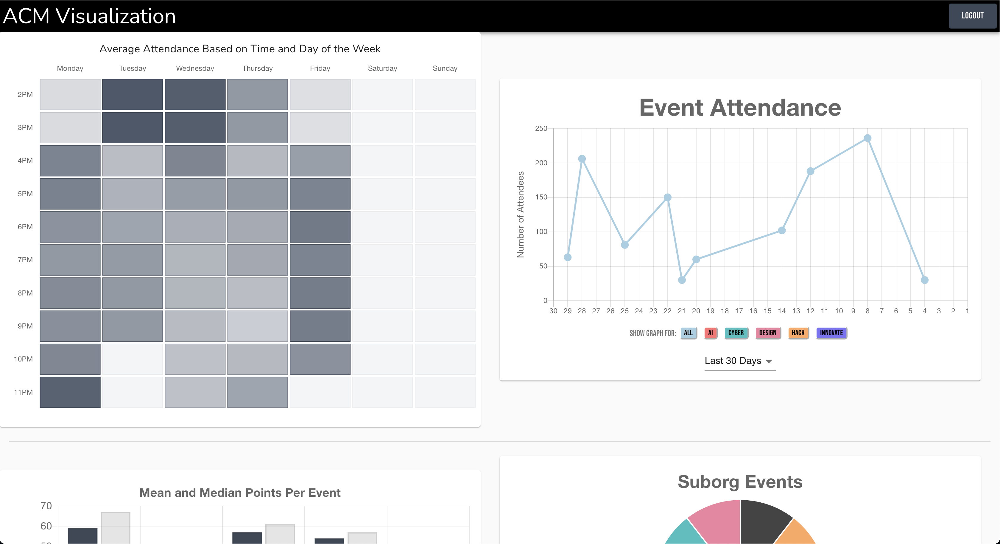
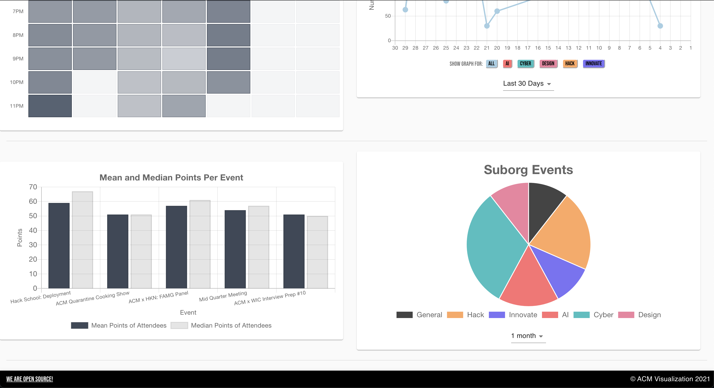
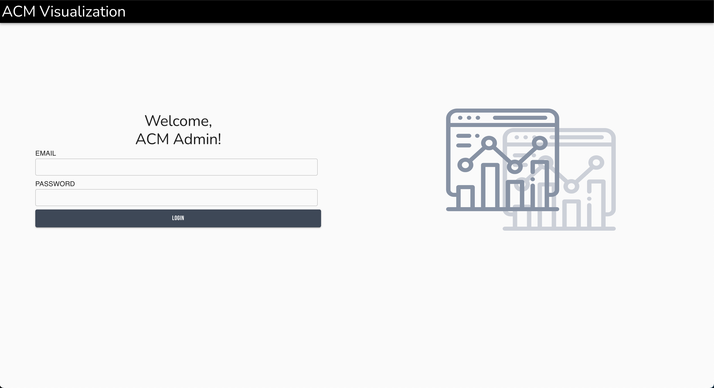

# ACM Visualization

## Screenshots

### Main Page

### Login Page

## Project Description

ACM Visualization is a web application that shows ACM event data in charts. This app has a heatmap for average attendance, a line chart for event attendance, a bar graph for mean and median points per event, and a pie chart for suborg events. It also has a login system to view the event data.  

## Technologies Used

* React
* Express
* Node.js
* PostgreSQL

## Set Up

1. Run `npm install` in both `/` and `/client`
2. Create a `config.env` file with a `DATABASE_URL` environment variable

## Commands

* `npm run server` (runs backend only)
* `npm run dev` (runs both frontend and backend)
